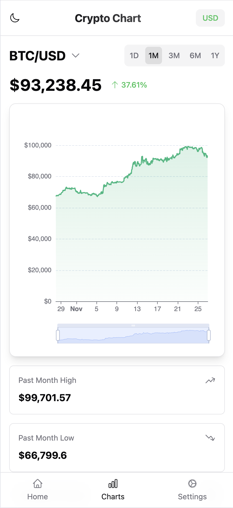

# Crypto Chart Dashboard

A modern, responsive cryptocurrency price tracking dashboard built with Nuxt 3, featuring real-time price updates, interactive charts, and seamless currency conversion.



## Features

- 📈 Real-time cryptocurrency price tracking
- 🎨 Modern UI with iPhone 15 Pro Max design
- 🌓 Light/Dark mode support
- 💱 USD/VND currency conversion with live exchange rates
- 📊 Interactive charts with multiple timeframes
- 🔍 Smart search with autocomplete
- 📱 Mobile-first responsive design
- 🔗 Shareable URLs for specific cryptocurrencies

## Tech Stack

- [Nuxt 3](https://nuxt.com/) - Vue.js Framework
- [Vue 3](https://vuejs.org/) - Progressive JavaScript Framework
- [Pinia](https://pinia.vuejs.org/) - State Management
- [TailwindCSS](https://tailwindcss.com/) - Utility-first CSS Framework
- [shadcn-vue](https://www.shadcn-vue.com/) - UI Components
- [ECharts](https://echarts.apache.org/) - Charting Library
- [Pyth Network API](https://pyth.network/) - Cryptocurrency Data
- [Exchange Rate API](https://www.exchangerate-api.com/) - Currency Conversion

## Getting Started

### Prerequisites

- Node.js 20.x or higher
- npm or yarn

### Installation

1. Clone the repository

```bash
git clone https://github.com/tcdtist/demo-crypto-chart.git
cd demo-crypto-chart
```

2. Install dependencies

```bash
npm install
# or
yarn install
```

3. Start development server

```bash
npm run dev
# or
yarn dev
```

4. Build for production

```bash
npm run build
# or
yarn build
```

### Environment Variables

Create a `.env` file in the root directory:

```env
NUXT_PUBLIC_API_BASE_URL=https://benchmarks.pyth.network/v1
NUXT_PUBLIC_EXCHANGE_API_URL=https://api.exchangerate-api.com/v4/latest/USD
```

## Project Structure

```
demo-crypto-chart/
├── src/
│   ├── assets/
│   │   └── css/
│   │       └── main.css
│   ├── components/
│   │   ├── CryptoChart.vue
│   │   ├── CurrencyToggle.vue
│   │   ├── SearchModal.vue
│   │   ├── ThemeToggle.vue
│   │   └── TimeRangeSelector.vue
│   ├── composables/
│   │   ├── useApi.ts
│   │   └── useExchangeRate.ts
│   ├── layouts/
│   │   └── default.vue
│   ├── pages/
│   │   └── index.vue
│   ├── stores/
│   │   └── crypto.ts
│   └── types/
│       └── api.ts
├── nuxt.config.ts
├── tailwind.config.ts
├── tsconfig.json
└── package.json
```

## API Integration

### Pyth Network API

The application uses Pyth Network's API for cryptocurrency price data:

- Benchmark Data: `/v1/shims/tradingview/history`
- Price Feeds: `/v1/price_feeds`

### Exchange Rate API

Currency conversion is handled through the Exchange Rate API, providing real-time USD to VND conversion rates.

## Features in Detail

### Time Range Selection

Users can view price data across different timeframes:

- 1 Day (1D)
- 1 Month (1M)
- 3 Months (3M)
- 6 Months (6M)
- 1 Year (1Y)

### Currency Conversion

Supports two currencies:

- USD (United States Dollar)
- VND (Vietnamese Dong)

Live exchange rates are fetched and applied to all price displays.

### Chart Features

- Line chart with gradient fill
- Interactive tooltip
- Price indicators (High, Low, Volume)
- Responsive design
- Smooth animations

### Search Functionality

- Real-time search with debouncing
- Autocomplete suggestions
- Symbol and description search
- URL sharing capability

## Contributing

1. Fork the repository
2. Create your feature branch (`git checkout -b feature/AmazingFeature`)
3. Commit your changes (`git commit -m 'Add some AmazingFeature'`)
4. Push to the branch (`git push origin feature/AmazingFeature`)
5. Open a Pull Request

## License

This project is licensed under the MIT License - see the [LICENSE](LICENSE) file for details

## Acknowledgments

- [Pyth Network](https://pyth.network/) for providing cryptocurrency data
- [shadcn/ui](https://ui.shadcn.com/) for the beautiful UI components
- [Heroicons](https://heroicons.com/) for the icons
- [Tailwind CSS](https://tailwindcss.com/) for the styling system

## Contact

Chi Thanh Dang (tist) - [@tcdtist](https://x.com/tcdtist)

Project Link: [https://github.com/tcdtist/demo-crypto-chart](https://github.com/tcdtist/demo-crypto-chart)

---
